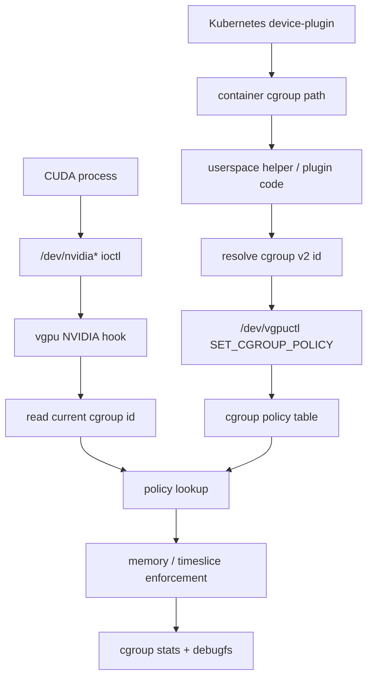

# vCUDA-kernel Cgroup Policy Design

Cgroup policy control adds cgroup-scoped policy ownership, accounting, and a Kubernetes
device-plugin integration surface. It keeps the module out-of-tree friendly:
the kernel module does not register a new Linux cgroup controller. Instead,
userspace supplies cgroup policy through `/dev/vgpuctl`, and the kernel matches
NVIDIA activity by the current task's cgroup v2 identity.

## Goals

- Identify NVIDIA GPU work by cgroup v2 identity.
- Store GPU policy by `(cgroup_id, gpu_minor)`.
- Apply cgroup policy to memory accounting and timeslice rewrite paths.
- Record cgroup-level memory and compute usage.
- Expose stable ioctl and debugfs surfaces for a Kubernetes device-plugin.
- Preserve tgid policy and verification flows.

## Non-Goals

- No custom Linux cgroup controller.
- No new cgroupfs kernel files owned by this module.
- No remote GPU call transport.
- No GPU memory oversubscription mechanism beyond existing accounting gates.

## Architecture Decision

Use existing cgroup v2 identity plus `/dev/vgpuctl` policy injection.

Rationale:

- A real cgroup controller is not a stable out-of-tree module interface.
- Kubernetes already gives the device-plugin access to pod/container cgroup
  paths.
- `/dev/vgpuctl` is already the control boundary and can be versioned as UAPI.
- Kernel enforcement can match `current` against cgroup identity inside the
  existing NVIDIA open/ioctl/release hook path.

## High-Level Flow

Full mechanism diagrams are in [cgroup-policy-flows.md](cgroup-policy-flows.md).



## Policy Matching

Policy lookup order:

```text
1. tgid policy, keyed by (tgid, gpu_minor)
2. cgroup policy, keyed by (cgroup_id, gpu_minor)
3. no policy
```

This keeps tgid-policy tools working and adds cgroup ownership without
breaking existing tests.

## UAPI Additions

Add cgroup policy structs to `include/vgpu_types.h`:

```c
struct vgpu_cgroup_policy {
    __u64 cgroup_id;
    __s32 gpu_minor;
    __u32 reserved0;
    __u64 memory_limit_bytes;
    __u32 compute_weight;
    __u32 flags;
};

struct vgpu_cgroup_policy_query {
    __u64 cgroup_id;
    __s32 gpu_minor;
    __u32 found;
    struct vgpu_cgroup_policy policy;
};

struct vgpu_cgroup_stats_snapshot {
    __u64 cgroup_id;
    __s32 gpu_minor;
    __u32 reserved0;
    __u64 memory_used_bytes;
    __u64 memory_alloc_seen;
    __u64 memory_free_seen;
    __u64 memory_would_deny;
    __u64 memory_denied;
    __u64 timeslice_seen;
    __u64 timeslice_would_rewrite;
    __u64 timeslice_rewritten;
    __u64 last_timeslice;
};
```

Add ioctls to `include/vgpu_ioctl.h`:

```c
#define VGPU_IOCTL_SET_CGROUP_POLICY \
    _IOW(VGPU_IOCTL_MAGIC, 6, struct vgpu_cgroup_policy)
#define VGPU_IOCTL_GET_CGROUP_POLICY \
    _IOWR(VGPU_IOCTL_MAGIC, 7, struct vgpu_cgroup_policy_query)
```

List APIs can wait until the policy table is stable. Debugfs gives early
visibility.

## Kernel Modules

New files:

```text
core/vgpu_cgroup.c
core/vgpu_cgroup.h
core/vgpu_cgroup_policy.c
core/vgpu_cgroup_policy.h
core/vgpu_cgroup_stats.c
core/vgpu_cgroup_stats.h
tests/kunit/vgpu_cgroup_policy_test.c
tests/kunit/vgpu_cgroup_stats_test.c
```

Existing files to update:

```text
core/vgpu_main.c
core/vgpu_task.c
core/vgpu_task.h
ctl/vgpu_ctl.c
ctl/vgpu_debugfs.c
nvidia/vgpu_nv_ioctl.c
include/vgpu_ioctl.h
include/vgpu_types.h
examples/Makefile
```

## Cgroup Identity

`vgpu_cgroup_current_id()` returns the current task's cgroup v2 id.

Expected kernel-side implementation path:

```text
current task -> css_set -> default cgroup -> kernfs id
```

Implementation must be compatibility-guarded for Ubuntu 5.15 first. If direct
field access is not stable enough, Cgroup policy control can begin with userspace-provided
`cgroup_id` in `/dev/vgpuctl` and kernel-side task matching added behind a
small wrapper after compile validation.

The wrapper boundary is mandatory:

```c
int vgpu_cgroup_current_id(__u64 *cgroup_id);
```

Callers must handle failure as `cgroup_id=0` and fall back to tgid policy only.

## Enforcement Integration

### Memory

When an allocation is charged:

1. Continue existing task/object accounting.
2. Resolve cgroup id for current task.
3. If cgroup policy has `VGPU_POLICY_F_MEMORY`, apply `memory_limit_bytes` to
   cgroup aggregate usage.
4. In dry-run mode, record `memory_would_deny` but do not deny.
5. In enforcing mode, reject allocation only when memory enforcement path is
   explicitly enabled and policy allows enforcement.

### Compute

When `NVA06C_CTRL_CMD_SET_TIMESLICE` is seen:

1. Try tgid policy.
2. If no tgid compute policy, try cgroup policy.
3. Scale timeslice by `compute_weight / 10000`.
4. Apply existing `TIMESLICE_MIN_US` / `TIMESLICE_MAX_US` clamps.
5. Record policy scope in the timeslice trace.
6. Rewrite only when runtime is enforcing and policy lacks `VGPU_POLICY_F_DRY_RUN`.

## Debugfs

Add files:

```text
/sys/kernel/debug/vgpu/cgroup_policies
/sys/kernel/debug/vgpu/cgroups
```

`cgroup_policies` output:

```text
cgroup_id=... gpu_minor=... memory_limit_bytes=... compute_weight=... flags=...
```

`cgroups` output:

```text
cgroup_id=... gpu_minor=... memory_used_bytes=... memory_alloc_seen=... memory_free_seen=... timeslice_seen=... timeslice_rewritten=... last_timeslice=...
```

Extend `tasks` output with:

```text
cgroup_id=...
```

Extend `timeslices` output with:

```text
policy_scope=tgid|cgroup|none cgroup_id=...
```

## Device-Plugin Contract

The device-plugin should:

1. Allocate a logical GPU slice to a container.
2. Resolve the container cgroup path to a stable cgroup v2 id.
3. Write `vgpu_cgroup_policy` through `/dev/vgpuctl`.
4. Optionally read debugfs for diagnostics and health checks.

Example helper interface:

```bash
./examples/vgpu_set_cgroup_policy \
  --cgroup-path /sys/fs/cgroup/... \
  --gpu-minor 0 \
  --memory-limit $((8 * 1024 * 1024 * 1024)) \
  --compute-weight 5000
```

The helper may use `name_to_handle_at()` or stat-based cgroup id lookup if the
kernel-side cgroup id format matches. The exact userspace resolver must be
validated on Ubuntu 5.15 with cgroup v2.

## Verification

Add targets:

```text
make verify-cgroup
cmake --build build --target verify-cgroup
```

Validation scenarios:

1. No cgroup policy: trace records `policy_scope=none`.
2. Cgroup compute policy only: timeslice rewrite uses cgroup weight.
3. Tgid policy plus cgroup policy: tgid policy wins.
4. Same cgroup, two processes: cgroup memory usage aggregates.
5. Different cgroups: stats do not cross-contaminate.
6. Policy dry-run: would-rewrite records, rewritten counter unchanged.

KUnit coverage:

- cgroup policy validation;
- cgroup policy rhashtable set/get/update;
- cgroup stats charge/uncharge and overflow handling;
- policy precedence helper: tgid before cgroup;
- debug reason/scope formatting where pure functions exist.

## Milestones

### Cgroup Identity Plumbing

- Add `vgpu_cgroup_current_id()` wrapper.
- Add `cgroup_id` to task snapshot.
- Record cgroup id in NVIDIA open/ioctl path.
- Show `cgroup_id` in `/sys/kernel/debug/vgpu/tasks`.
- KUnit: pure helper tests where possible.
- Manual validation: process in known cgroup shows nonzero cgroup id.

### Cgroup Policy UAPI

- Add `vgpu_cgroup_policy` and query structs.
- Add set/get cgroup policy ioctls.
- Add cgroup policy table.
- Add `/sys/kernel/debug/vgpu/cgroup_policies`.
- Add `examples/vgpu_set_cgroup_policy`.
- KUnit: validation, set/get/update, missing policy.

### Compute Policy Match

- Add policy scope resolver: tgid -> cgroup -> none.
- Timeslice path uses cgroup policy when no tgid policy exists.
- `timeslices` includes `policy_scope` and `cgroup_id`.
- `make verify-cgroup-compute` or `make verify-cgroup` first half.

### Cgroup Memory Stats

- Add cgroup memory stats table.
- Charge/free by RM object into cgroup aggregate.
- Enforce cgroup memory limit in dry-run first.
- Add `/sys/kernel/debug/vgpu/cgroups`.
- KUnit: charge/free, duplicate object, unmatched free, overflow.

### Device-Plugin Readiness

- Stabilize `vgpu_set_cgroup_policy` CLI.
- Document device-plugin call sequence.
- Add `make verify-cgroup` end-to-end script.
- Update README with Cgroup policy control usage once verified.

## Risks

| Risk | Mitigation |
|---|---|
| cgroup id lookup differs across kernels | isolate in `vgpu_cgroup_current_id()` and validate on 5.15 first |
| cgroup id userspace/kernel mismatch | add helper tool and debugfs echo of observed task `cgroup_id` |
| memory stats double-count on duplicate RM object | reuse object-handle replacement semantics from task accounting |
| policy ambiguity | fixed precedence: tgid > cgroup > none |
| device-plugin needs path-based API | keep path resolution in userspace helper first |

## Acceptance Criteria

- `make` builds on Ubuntu 5.15 NVIDIA 570/580 host.
- `make test-kunit` includes cgroup policy/stats tests.
- `make verify-cgroup` passes on a cgroup v2 host.
- A process with no tgid policy can be controlled by cgroup policy.
- Debugfs shows cgroup policy and cgroup usage records.
- Existing `make verify-compute` still passes.
