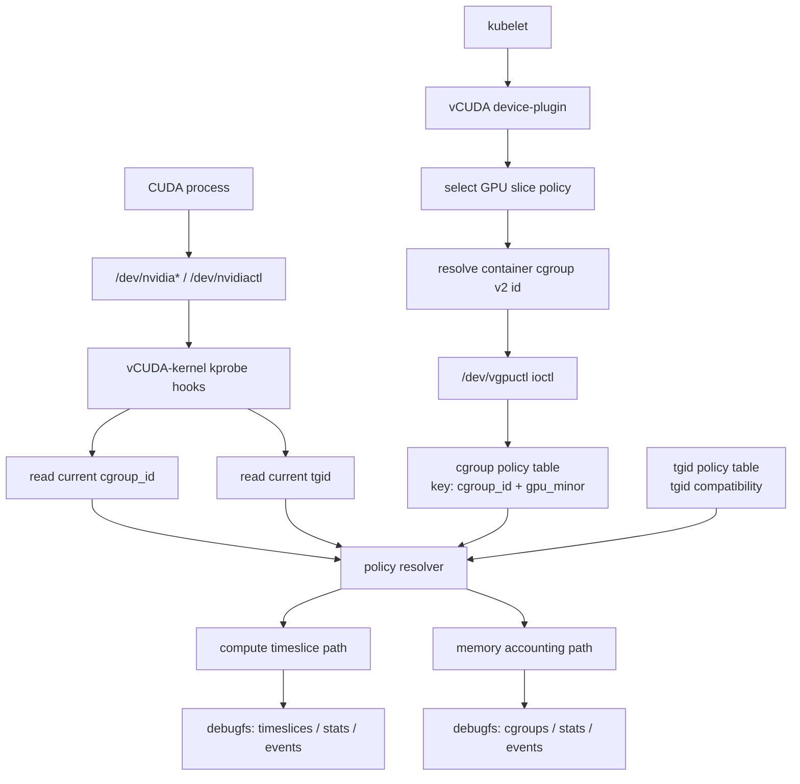
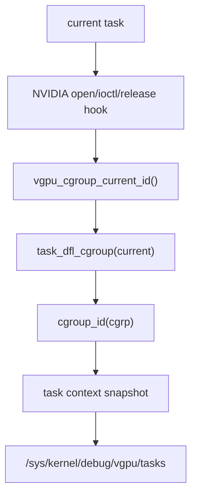
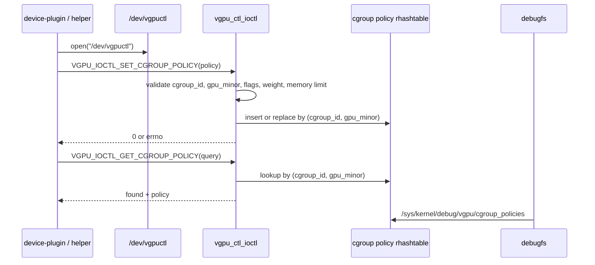
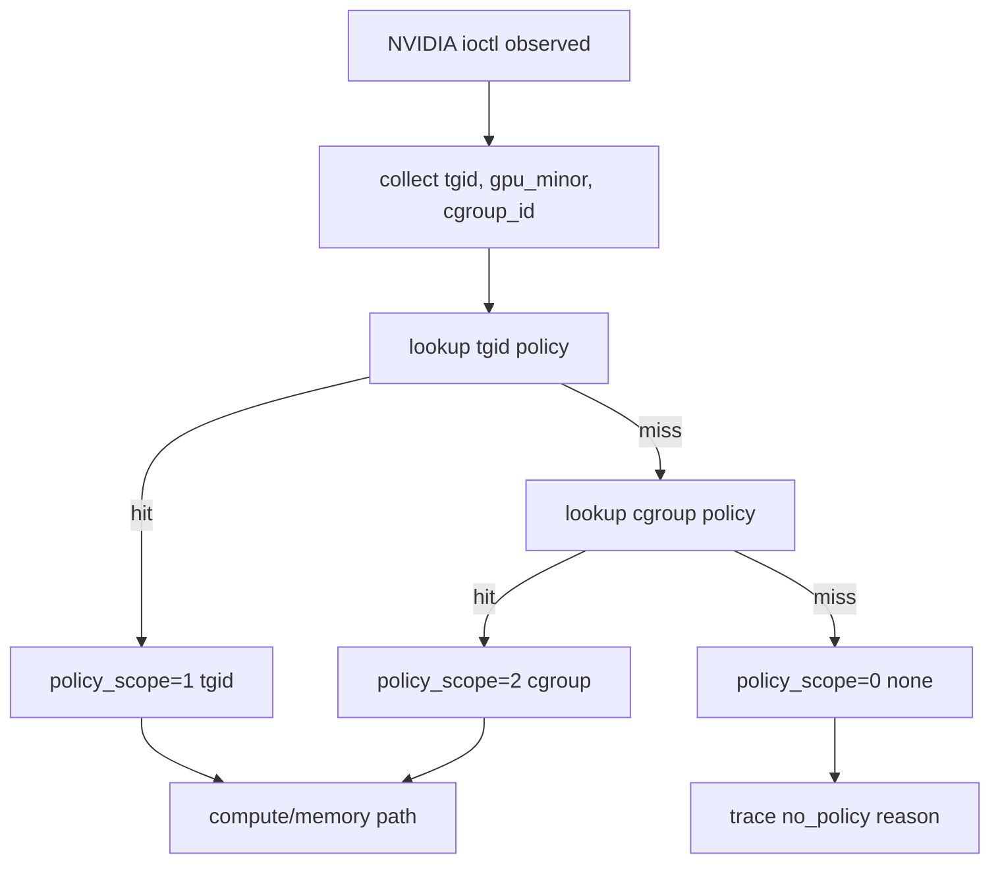
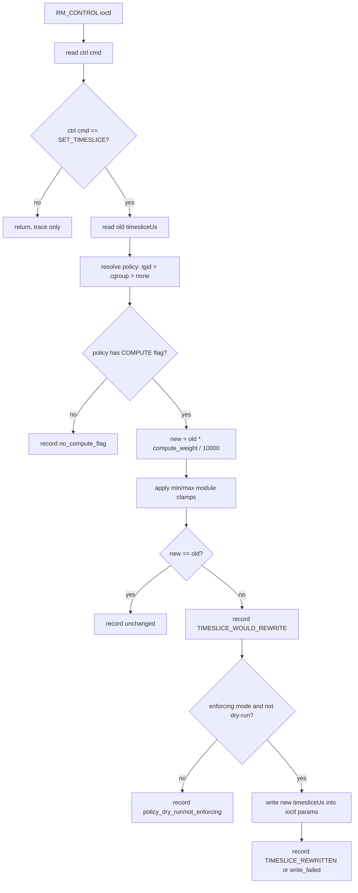
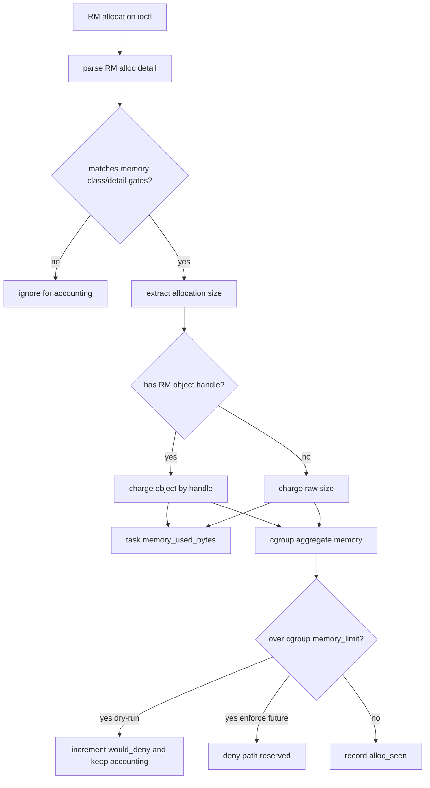
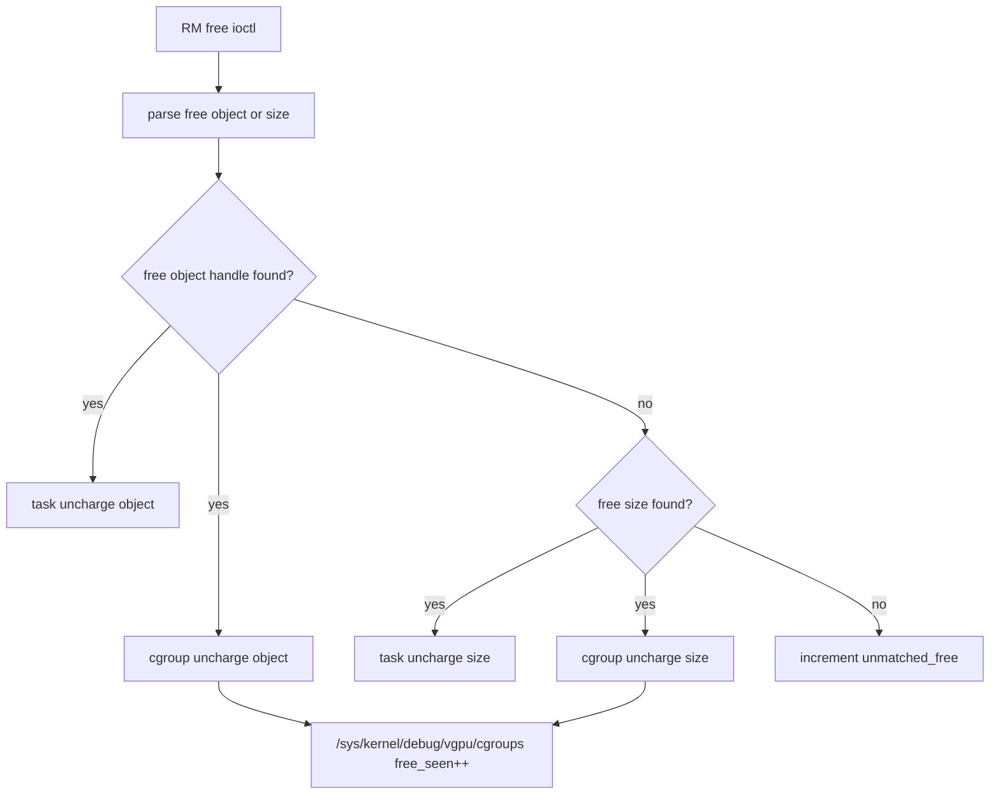
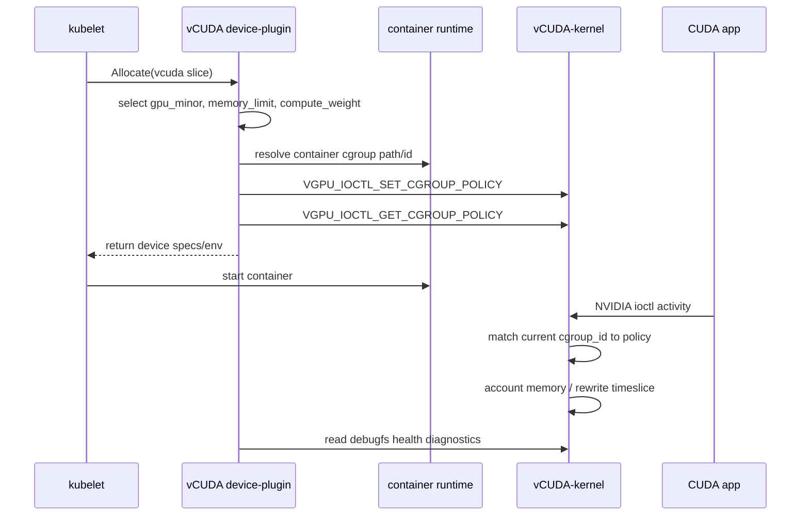
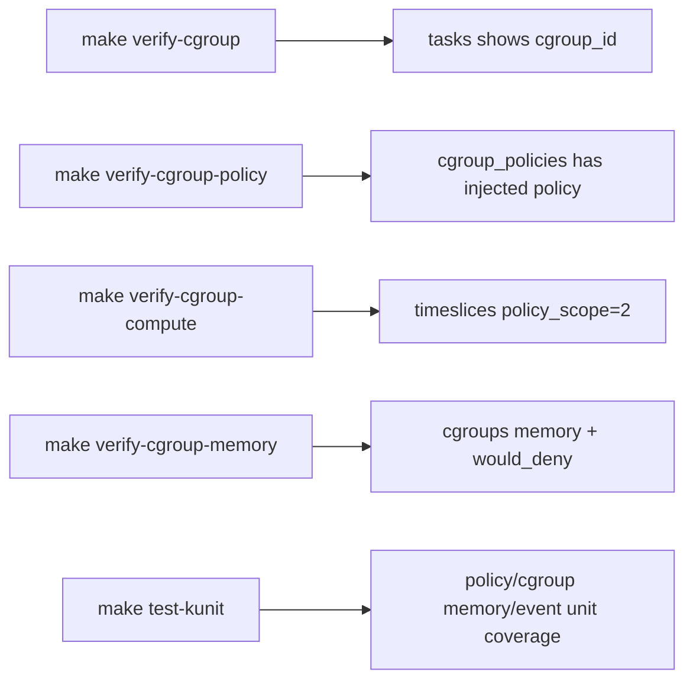

# Cgroup Policy Mechanisms and Flows

Cgroup policy control implements cgroup-scoped GPU control without adding a custom
Linux cgroup controller. The design uses existing cgroup v2 identity as the
ownership key, `/dev/vgpuctl` as the policy injection boundary, NVIDIA ioctl
hooks as the enforcement point, and debugfs as the verification surface.

## 1. Overall Architecture



Principle:

- Device-plugin owns policy creation because Kubernetes knows which pod/container should receive a GPU slice.
- Kernel owns enforcement because CUDA user-space can bypass LD_PRELOAD hooks.
- cgroup v2 id is the stable runtime identity used to bind a container to a GPU policy.
- tgid policy remains supported and has higher priority, preserving tgid-level behavior and debugging tools.

## 2. Cgroup Identity Flow



Principle:

- The kernel reads cgroup identity at the same point it observes NVIDIA device activity.
- `tasks` debugfs shows the observed `cgroup_id`, allowing userspace/device-plugin to confirm id matching.
- No custom cgroup controller is registered, so the module stays out-of-tree friendly.

Key files:

- `core/vgpu_cgroup.c`
- `core/vgpu_task.c`
- `ctl/vgpu_debugfs.c`

## 3. Policy Injection Flow



Principle:

- `/dev/vgpuctl` is the control-plane boundary.
- `VGPU_IOCTL_SET_CGROUP_POLICY` is idempotent for the same `(cgroup_id, gpu_minor)` key.
- `VGPU_IOCTL_GET_CGROUP_POLICY` gives the device-plugin a read-back check before trusting enforcement.
- debugfs is read-only diagnostic state, not the control API.

Policy shape:

```c
struct vgpu_cgroup_policy {
    __u64 cgroup_id;
    __s32 gpu_minor;
    __u32 reserved0;
    __u64 memory_limit_bytes;
    __u32 compute_weight;
    __u32 flags;
};
```

Flags:

- `VGPU_POLICY_F_MEMORY`: apply memory limit accounting.
- `VGPU_POLICY_F_COMPUTE`: apply compute timeslice scaling.
- `VGPU_POLICY_F_DRY_RUN`: record would-deny/would-rewrite without write-capable enforcement.

Key files:

- `include/vgpu_types.h`
- `include/vgpu_ioctl.h`
- `ctl/vgpu_ctl.c`
- `core/vgpu_policy.c`

## 4. Policy Resolver Flow



Principle:

- Priority is fixed: `tgid > cgroup > none`.
- tgid policy is useful for targeted debugging or compatibility with tgid-level tools.
- cgroup policy is the Kubernetes path because all container processes share cgroup ownership.
- `policy_scope` is recorded in timeslice traces so verification can prove which policy source won.

Debug evidence:

```text
/sys/kernel/debug/vgpu/timeslices
policy_scope=0  # no policy
policy_scope=1  # tgid policy
policy_scope=2  # cgroup policy
```

Key files:

- `nvidia/vgpu_nv_ioctl.c`
- `ctl/vgpu_events.h`
- `ctl/vgpu_events.c`
- `ctl/vgpu_debugfs.c`

## 5. Compute Timeslice Enforcement Flow



Principle:

- NVIDIA TSG scheduling uses a timeslice field inside an RM control parameter block.
- The hook reads the requested `timesliceUs`, scales it by `compute_weight`, then optionally writes it back before the real NVIDIA ioctl handler consumes it.
- `compute_weight=10000` means 100%; `5000` means 50% relative timeslice.
- Dry-run mode records what would happen without mutating user/kernel ioctl memory.

Verification:

```bash
make verify-cgroup-compute
cat /sys/kernel/debug/vgpu/timeslices | tail -n 20
```

Expected cgroup path evidence:

```text
policy_scope=2 cgroup_id=<non-zero> name=TIMESLICE_WOULD_REWRITE
```

Key files:

- `nvidia/vgpu_nv_ioctl.c`
- `scripts/verify_cgroup_compute.sh`

## 6. Memory Accounting Flow



Principle:

- RM allocation object handles are the safest key for avoiding duplicate counting.
- Duplicate object charge replaces the previous size, so aggregate memory tracks current live object size.
- cgroup aggregate stats are separate from task-local stats. Task stats remain useful for process-level debugging; cgroup stats are the Kubernetes accounting surface.
- Cgroup policy control applies cgroup memory limit in dry-run first. It records `would_deny`, but does not block allocations yet.

Debug evidence:

```text
/sys/kernel/debug/vgpu/cgroups
cgroup_id=<id> gpu_minor=255 memory_used_bytes=... alloc_seen=... free_seen=... would_deny=...
```

Key files:

- `core/vgpu_cgroup_mem.c`
- `nvidia/vgpu_nv_ioctl.c`
- `ctl/vgpu_debugfs.c`
- `scripts/verify_cgroup_memory.sh`

## 7. Memory Free Flow



Principle:

- Free by object is preferred because it mirrors allocation object tracking.
- If only size exists, the cgroup aggregate subtracts size conservatively.
- Underflow clamps to zero rather than wrapping, preventing bogus large memory usage.

## 8. Device-Plugin Runtime Flow



Principle:

- Device-plugin does scheduling and policy ownership.
- Kernel module does low-level enforcement and accounting.
- Debugfs gives health and verification state, but should not become the control plane.

Device-plugin docs:

- `../device-plugin/README.md`
- `../device-plugin/docs/kernel-uapi.md`
- `../device-plugin/docs/call-sequence.md`

## 9. Verification Matrix



Expected PASS output:

```text
PASS: verify-cgroup
PASS: verify-cgroup-policy cgroup_id=...
PASS: verify-cgroup-compute cgroup_id=...
PASS: verify-cgroup-memory cgroup_id=...
```

Failure output starts with `FAILED:` and includes the failing condition.

## 10. Current Limits

- Cgroup memory limit is dry-run first; hard allocation denial is intentionally not enabled yet.
- Policy deletion is not implemented. Device-plugin cleanup should overwrite stale policy with a harmless dry-run policy until delete UAPI exists.
- Userspace cgroup path to kernel `cgroup_id` resolution must be validated on the target host.
- `gpu_minor=255` remains the observed global/control-device path in current validation; per-minor matching can be tightened when GPU minor attribution is stable for every RM call.
