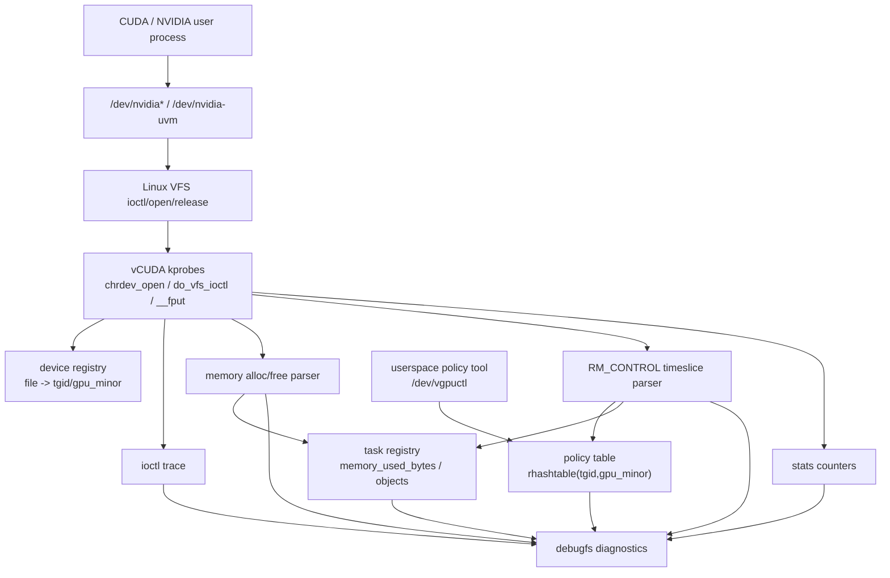
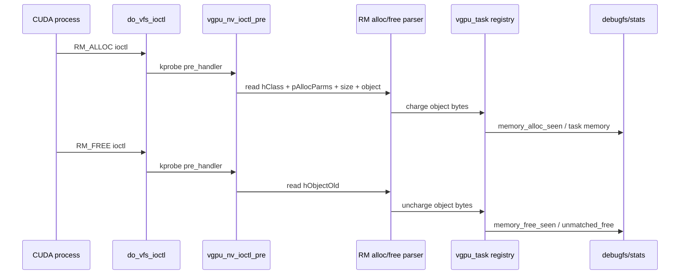
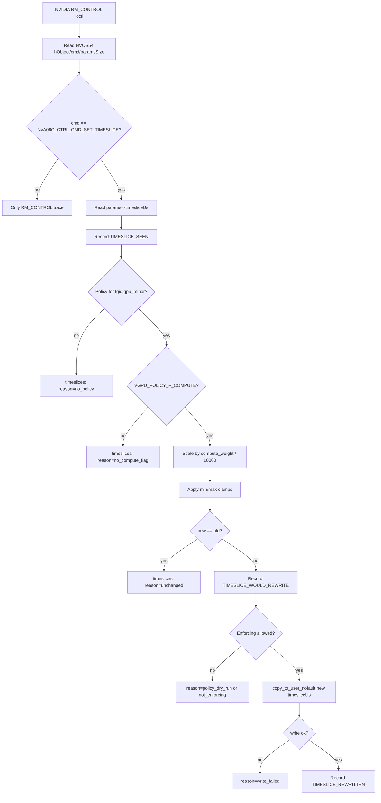
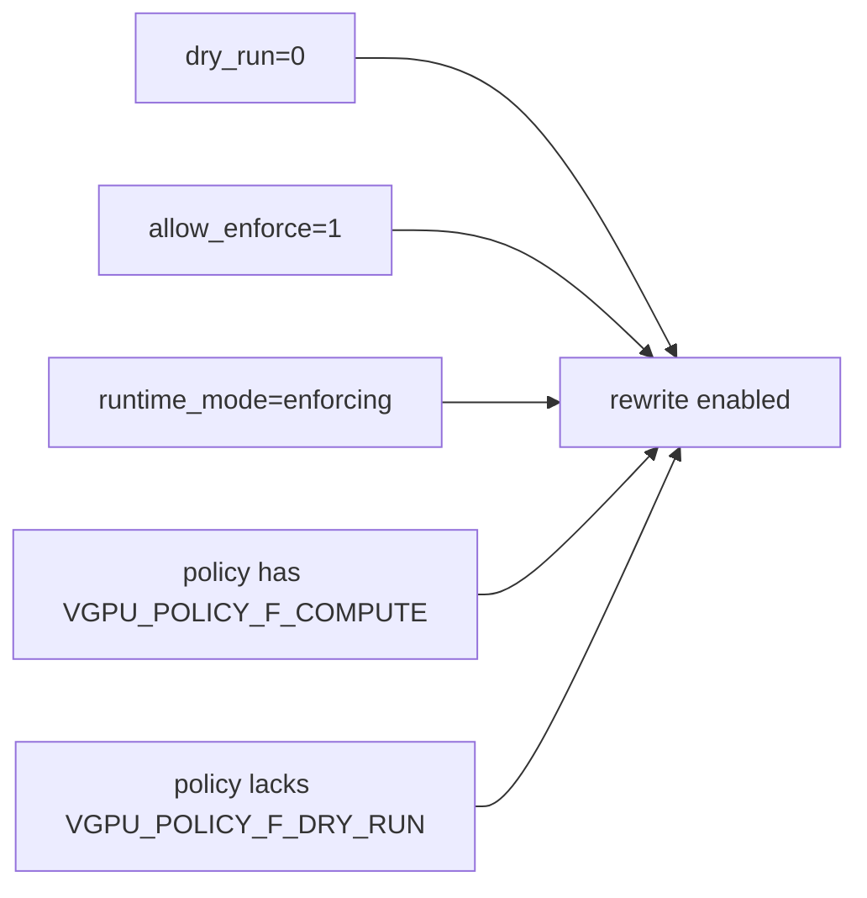

# vCUDA-kernel Kernel Enforcement Design

Kernel enforcement implements kernel-side enforcement primitives for NVIDIA GPU resource
virtualization. It focuses on three goals:

- trace NVIDIA task/device activity from kernel space;
- account task-local GPU memory allocations and frees;
- dry-run and enforce compute scheduling by rewriting RM timeslice control
  parameters.

The implementation is intentionally dry-run first. Write-capable enforcement is
enabled only when the module is loaded with `dry_run=0 allow_enforce=1` and a
matching policy exists.

## Program Paths

### Module Lifecycle

| Stage | File | Function | Role |
|---|---|---|---|
| load | `core/vgpu_main.c` | `vgpu_init` | initializes stats, events, ioctl trace, policy table, task registry, device registry, control device, NVIDIA probes, NVIDIA ioctl hooks, debugfs |
| unload | `core/vgpu_main.c` | `vgpu_exit` | unregisters debugfs, NVIDIA hooks, probes, control device, device/task registries, and policies |
| runtime mode | `core/vgpu_main.c` | `dry_run`, `allow_enforce` | selects `VGPU_MODE_DRY_RUN`, `VGPU_MODE_TRACE_ONLY`, or `VGPU_MODE_ENFORCING` |

### NVIDIA Device Hook Path

| Hook | File | Function | Purpose |
|---|---|---|---|
| open | `nvidia/vgpu_nv_ioctl.c` | `vgpu_nv_chrdev_open_pre` | tracks NVIDIA fd ownership and task context |
| ioctl | `nvidia/vgpu_nv_ioctl.c` | `vgpu_nv_ioctl_pre` | traces ioctl, handles memory alloc/free accounting, handles RM_CONTROL timeslice tracing/rewrite |
| release | `nvidia/vgpu_nv_ioctl.c` | `vgpu_nv_fput_pre` | decrements fd refs and optionally clears stale memory accounting |

### Policy Path

| Path | File | Function | Purpose |
|---|---|---|---|
| userspace control | `ctl/vgpu_ctl.c` | `vgpu_ctl_ioctl` | exposes `/dev/vgpuctl` ioctls |
| set policy | `ctl/vgpu_ctl.c` | `vgpu_ctl_set_policy` | copies `struct vgpu_policy` from user space and stores it |
| policy store | `core/vgpu_policy.c` | `vgpu_policy_set/get` | rhashtable keyed by `(tgid, gpu_minor)` |
| policy schema | `include/vgpu_types.h` | `struct vgpu_policy` | `tgid`, `gpu_minor`, `memory_limit_bytes`, `compute_weight`, `flags` |

### Task And Accounting Path

| Path | File | Function | Purpose |
|---|---|---|---|
| task state | `core/vgpu_task.c` | `vgpu_task_get_or_create_locked` | stores `(pid,tgid,gpu_minor,nvidia_major,fd_refs,memory,last_timeslice)` |
| memory charge | `core/vgpu_task.c` | `vgpu_task_memory_charge_object` | charges object-based allocations and replaces object size on duplicate handle |
| memory free | `core/vgpu_task.c` | `vgpu_task_memory_uncharge_object` | frees by RM object handle and subtracts charged bytes |
| timeslice state | `core/vgpu_task.c` | `vgpu_task_timeslice_update` | records last observed or rewritten timeslice for a task |

### Diagnostics Path

| Debugfs file | Producer | Purpose |
|---|---|---|
| `/sys/kernel/debug/vgpu/enabled` | `ctl/vgpu_debugfs.c` | runtime mode |
| `/sys/kernel/debug/vgpu/hooks` | `nvidia/vgpu_nv_ioctl.c` | hook status and active module params |
| `/sys/kernel/debug/vgpu/policies` | `core/vgpu_policy.c` | current policies |
| `/sys/kernel/debug/vgpu/tasks` | `core/vgpu_task.c` | task memory/timeslice snapshots |
| `/sys/kernel/debug/vgpu/events` | `ctl/vgpu_events.c` | generic ring events |
| `/sys/kernel/debug/vgpu/timeslices` | `ctl/vgpu_events.c` | timeslice-specific ring, resistant to ioctl flood |
| `/sys/kernel/debug/vgpu/ioctls` | `core/vgpu_ioctl_trace.c` | ioctl command counts |
| `/sys/kernel/debug/vgpu/rm_controls` | `core/vgpu_ioctl_trace.c` | RM_CONTROL command counts |
| `/sys/kernel/debug/vgpu/alloc_pairs` | `core/vgpu_ioctl_arg.c` | `(cmd,hclass,size)` allocation observations |
| `/sys/kernel/debug/vgpu/alloc_details` | `core/vgpu_ioctl_arg.c` | decoded RM allocation fields |
| `/sys/kernel/debug/vgpu/stats` | `core/vgpu_stats.c` | counters for validation and automation |

## Core Principles

### Dry-run first

The module can trace and calculate decisions without changing NVIDIA state.
Enforcement requires all of these:

- module load `dry_run=0`;
- module load `allow_enforce=1`;
- runtime mode `VGPU_MODE_ENFORCING`;
- matching policy with `VGPU_POLICY_F_COMPUTE`;
- policy does not set `VGPU_POLICY_F_DRY_RUN`.

### OKM-guided ABI discovery

`scripts/extract_okm_defaults.sh` reads NVIDIA Open GPU Kernel Modules headers
and emits defaults consumed by `make load`:

- `NV_ESC_RM_ALLOC` -> `memory_alloc_ioctl_cmd`;
- `NV_ESC_RM_FREE` -> `memory_free_ioctl_cmd`;
- `NV_ESC_RM_CONTROL` -> `rm_control_ioctl_cmd`;
- `NVOS21_PARAMETERS.hClass`;
- `NVOS21_PARAMETERS.pAllocParms`;
- `NVOS00_PARAMETERS.hObjectOld`;
- `NV_MEMORY_ALLOCATION_PARAMS.size`;
- `NVA06C_CTRL_CMD_SET_TIMESLICE`.

Fallback values exist for the observed NVIDIA 570/580 ABI, but OKM is the
preferred source.

## Architecture



## Memory Accounting Design

### Allocation Path

1. `do_vfs_ioctl` kprobe enters `vgpu_nv_ioctl_pre`.
2. `vgpu_nv_file_match` verifies NVIDIA major.
3. `vgpu_device_lookup_file` maps fd to task identity when possible.
4. `vgpu_nv_read_memory_class` reads `NVOS21_PARAMETERS.hClass`.
5. `vgpu_nv_read_nested_ptr` reads `NVOS21_PARAMETERS.pAllocParms`.
6. `vgpu_nv_read_memory_size` reads `NV_MEMORY_ALLOCATION_PARAMS.size`.
7. `vgpu_nv_read_alloc_detail` samples owner/type/flags/attr/offset/limit/tag.
8. Class/detail/min/max gates decide whether bytes count toward task memory.
9. If `detail.object` exists, `vgpu_task_memory_charge_object` records
   `(tgid,gpu_minor,hObject)->bytes` and updates task memory.
10. Stats and events record `memory_alloc_seen` and would-deny state.

### Free Path

1. `vgpu_nv_ioctl_pre` matches `memory_free_ioctl_cmd`.
2. `vgpu_nv_read_free_object` reads `NVOS00_PARAMETERS.hObjectOld`.
3. `vgpu_task_memory_uncharge_object` removes matching object entry.
4. Task `memory_used_bytes` is decremented by the remembered object bytes.
5. `unmatched_free` increments only when free cannot be matched or underflows.

### Memory Flow



## Compute Timeslice Enforcement Design

### Observed NVIDIA Path

The modern NVIDIA path uses RM_CONTROL command:

- wrapper ioctl: `NV_ESC_RM_CONTROL` -> `rm_control_ioctl_cmd`;
- wrapper layout: `NVOS54_PARAMETERS`;
- control command: `NVA06C_CTRL_CMD_SET_TIMESLICE = 0xa06c0103`;
- parameter struct: `NVA06C_CTRL_TIMESLICE_PARAMS`;
- rewritten field: `timesliceUs` at offset `timeslice_us_offset`, default `0`.

### Rewrite Algorithm

For a matched `(tgid,gpu_minor)` policy:

```text
new_timeslice_us = old_timeslice_us * compute_weight / 10000
```

Then safety clamps apply:

```text
if TIMESLICE_MIN_US != 0 and new < min: new = min
if TIMESLICE_MAX_US != 0 and new > max: new = max
```

`compute_weight=10000` means 100% of the observed NVIDIA timeslice.
`compute_weight=5000` means 50%.

### Timeslice Flow



### Enforcement Gate



## Debug And Verification Design

### Persistent Evidence

Generic events can be overwritten by ioctl flood, so timeslice evidence has a
dedicated ring:

```text
/sys/kernel/debug/vgpu/timeslices
```

Each record includes:

- event name;
- pid/tgid/gpu_minor;
- old and new timeslice;
- compute weight;
- reason and reason name;
- write error if any.

Reasons:

| Reason | Meaning |
|---|---|
| `none` | normal trace/rewrite path |
| `no_policy` | no policy for `(tgid,gpu_minor)` |
| `no_compute_flag` | policy exists but does not enable compute |
| `unchanged` | scaled timeslice equals original |
| `policy_dry_run` | policy explicitly forces dry-run |
| `not_enforcing` | module/runtime not in enforcing mode |
| `write_failed` | `copy_to_user_nofault` failed |
| `clamped_min` | min clamp raised rewritten value |
| `clamped_max` | max clamp lowered rewritten value |

### Verification Paths

| Command | Purpose |
|---|---|
| `make example` | builds CUDA smoke workloads and policy helper |
| `make verify-compute` | reloads module, sets policy, runs workload, checks stats and timeslice trace |
| `make test-kunit` | runs KUnit tests |
| `cmake --build build --target verify-compute` | CMake wrapper for compute verification |
| `cmake --build build --target test-kunit` | CMake wrapper for KUnit |

## Test Coverage Plan

Current KUnit coverage includes:

- policy validation and table behavior;
- ioctl trace aggregation;
- ioctl argument sampling;
- event/timeslice reason mapping and snapshot behavior;
- task memory/object/timeslice state transitions.

Coverage publishing is planned through:

```text
KUnit + CONFIG_GCOV_KERNEL + lcov/gcovr + coverage CI badge
```

## Kernel Enforcement Boundary

Included:

- kernel module lifecycle;
- NVIDIA file/ioctl/release tracing;
- task-local memory object accounting;
- VMM allocate/free accounting;
- RM_CONTROL timeslice tracing;
- timeslice dry-run and enforcement;
- debugfs diagnostics;
- KUnit and verification entrypoints.

Deferred to cgroup policy control:

- cgroupfs policy ownership;
- persistent cgroup stats;
- Kubernetes device-plugin policy injection;
- production coverage publishing workflow.

Deferred to remote execution:

- remote GPU call transport;
- user-space RPC protocol;
- cross-node scheduling integration.
